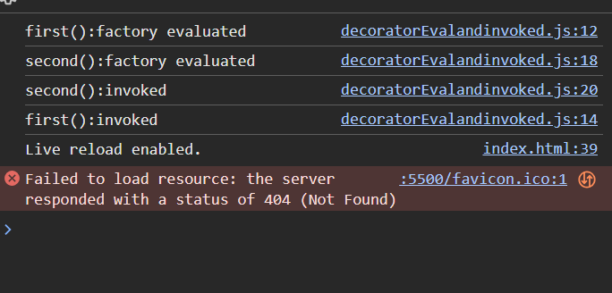

the decorator functions are invoked once the class is created but before any instance of that class is instantiated. The decorators are called to modify the method (or the class if necessary) before the class constructor is called.

# Thing to know
Decorator Factory Execution (Compile Time): When you define a decorator like @AddLogging, the factory function (AddLogging) is evaluated during the compilation or loading phase. It’s executed immediately when the code is processed and defines what the decorator will do.

Decorator Function Invocation (Runtime): After the class is defined and the program starts running, the decorator function (the one returned by AddLogging) is invoked at runtime to actually modify the class. This is when the class is modified or extended, such as adding methods or changing properties.

# what i have learned from it

let me tell you when we have make a decorator using factory function then what will happen is at the parse phase ...when it sees @functionname() it will automatically be called and get the actual decorator and it will only be invoked at the run time ....like modifying the class ..with what functionality provide in our decorator function... am i right?